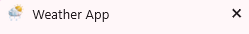
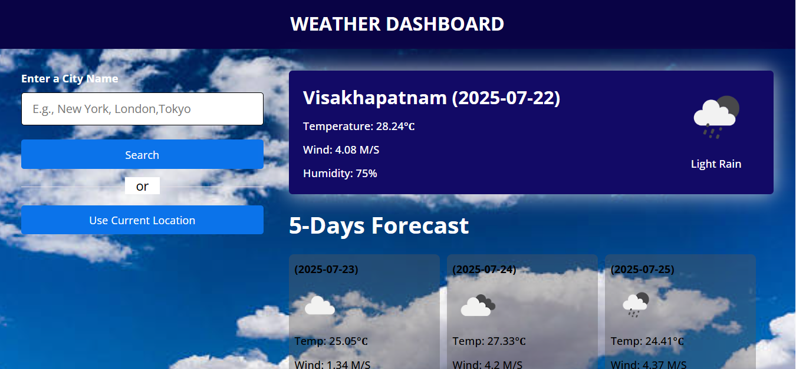
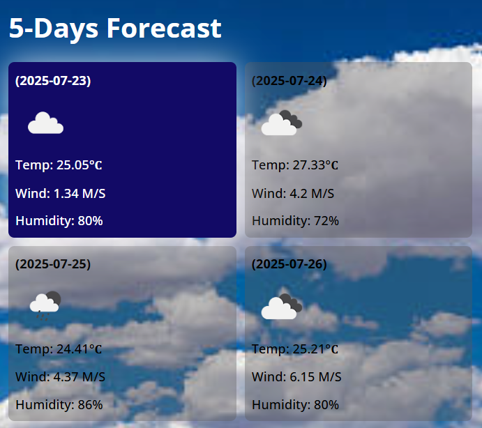

# 🌤️ Weather App
A responsive weather dashboard that lets users search for current weather and a 5-day forecast by city name or use their current location. Built with HTML, CSS, and JavaScript using the OpenWeatherMap API.


Added an icon to the weather application



Taking input city from user --


Preview



Hover effect --




Hover effect for weather cards(5-days forecast)


## 🚀 Features
- 🔍 Search by City: Type in any city to get its current weather and forecast.
- 📍 Use Current Location: Automatically fetches weather for your current location using geolocation.
- 🕔 5-Day Forecast: Displays upcoming weather including temperature, wind speed, and humidity.
- 🎨 Responsive Design: Fully responsive layout optimized for desktops and mobile devices.


## 🛠️ Technologies Used
- HTML5
- CSS3 (with media queries for responsiveness)
- JavaScript (Vanilla)
- OpenWeatherMap API

## 🧾 Setup Instructions
1. Clone the Repository
```bash
git clone https://github.com/your-username/weather-app.git
cd weather-app
```

2. Get Your API Key
Go to OpenWeatherMap
Create a free account and generate an API key

3. Add Your API Key
Replace the API key string in script.js with your own:
```bash
const API_KEY = "YOUR_API_KEY_HERE";
```

5. Open in Browser
You can open index.html directly in a browser or use a live server (VS Code extension recommended).

## 📂 File Structure
```bash
weather-app/
│
├── Readme.md          # Project documentation
├── index.html         # Main HTML page
├── style.css          # All styling
├── script.js          # Core logic, API integration
└── sky.jpg            # Background image
```

## ❗ Notes
- Make sure location permission is allowed for the geolocation feature to work.
- Temperature is shown in °C and wind in meters per second (M/S).

## Contribution
Feel free to fork this repository, give it a ⭐, or contribute with improvements!
